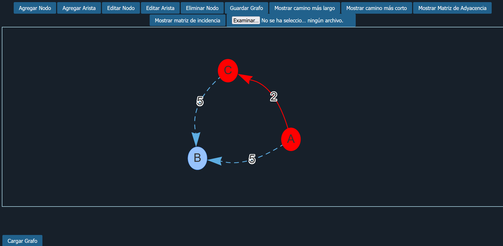

# Visualizador Interactivo de Grafos

Herramienta web para crear, editar y analizar grafos dirigidos y ponderados de forma visual e interactiva, sin necesidad de instalar nada — corre directo en el navegador.

## Qué hace

Permite construir un grafo desde cero (nodos y aristas con peso), visualizarlo en tiempo real, calcular caminos más cortos y más largos entre dos nodos, generar sus matrices de adyacencia e incidencia, y guardar/cargar el grafo como archivo JSON para retomar el trabajo después.

## Problema que resuelve

El análisis de grafos (rutas óptimas, matrices, teoría de grafos aplicada) normalmente se hace en papel o con herramientas complejas de instalar. Este proyecto lo resuelve con una interfaz simple de un solo archivo HTML: se abre, se construye el grafo con clics, y se obtienen los resultados al instante — útil tanto para fines educativos (cursos de estructuras de datos/algoritmos) como para prototipar problemas de rutas y redes.

## Funcionalidades

- **Construcción del grafo:** agregar, editar y eliminar nodos y aristas ponderadas
- **Caminos óptimos:**
  - Camino más corto (algoritmo tipo Dijkstra)
  - Camino más largo (algoritmo tipo Bellman-Ford modificado)
  - Resalta la ruta encontrada directamente sobre el grafo (en rojo) y muestra la distancia total
- **Matrices:** genera y muestra la matriz de adyacencia y la matriz de incidencia del grafo en una ventana aparte
- **Persistencia:** exporta el grafo actual a un archivo `.json` y permite cargarlo de nuevo más adelante
- **Visualización:** grafo dirigido interactivo (arrastrar nodos, zoom) renderizado con `vis-network`

## Cómo funciona (tecnologías)

- **HTML + JavaScript vanilla** — sin frameworks, un solo archivo autocontenido
- **[vis-network](https://visjs.github.io/vis-network/docs/network/)** — renderizado y layout del grafo interactivo
- **[FileSaver.js](https://github.com/eligrey/FileSaver.js/)** — exportación del grafo a JSON
- **Estructura de datos propia** (`Graph`) — implementación manual de lista de adyacencia con pesos, sobre la que corren los algoritmos de camino más corto/largo

## Cómo usarlo

1. Descarga o clona el repositorio
2. Abre el archivo `.html` directamente en el navegador (no requiere servidor ni instalación)
3. Usa los botones para construir el grafo:
   - **Agregar Nodo** / **Agregar Arista** para construirlo
   - **Editar Nodo** / **Editar Arista** / **Eliminar Nodo** para modificarlo
   - **Mostrar camino más corto** / **Mostrar camino más largo** ingresando nodo de inicio y fin
   - **Mostrar Matriz de Adyacencia** / **Mostrar matriz de incidencia** para ver las matrices en una ventana nueva
   - **Guardar Grafo** para descargarlo como JSON, **Cargar Grafo** para retomar uno guardado

## Demo

*Ejemplo: grafo con 3 nodos donde se calculó y resaltó el camino más corto entre A y C.*

## Posibles mejoras futuras

- Soporte para grafos no dirigidos
- Validación de entradas (actualmente usa `prompt()`, se podría migrar a un formulario)
- Detección de ciclos antes de calcular camino más largo (el algoritmo asume ausencia de ciclos positivos)
